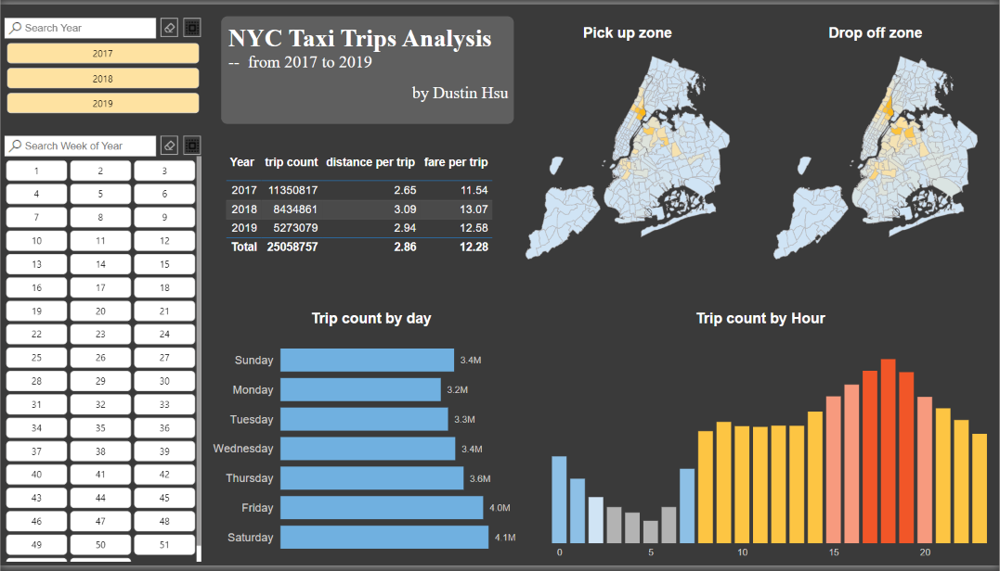
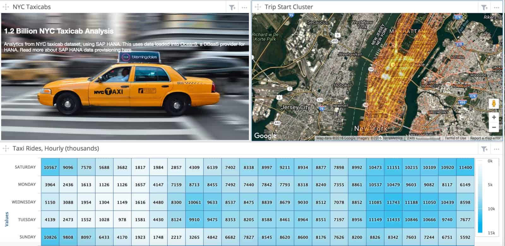

# Homework 2

## Objective

Download the publicly available NYC Taxi Dataset and use it to create an interactive Streamlit app that:
- allows users to select a date range;
- displays some aggregate statistics about the taxi rides in that date range, and compares them to the entire dataset;
- displays an interesting timeseries plot of the data for the selected date range;
- displays an interesting map visualization of the data for the selected date range;
- makes use of caching to improve the performance of the app.

Make sure you use a version of the dataset that is at least 1 GB in size. You can look into the streamlit cache operator (`@st.cache_data`) to cache the data loading and processing steps, or implement your own caching mechanism.

## Inspiration

## Submission
Submit a single .zip file containing:
- an app.py file with the Streamlit app code; Should be runnable with `streamlit run app.py`;
- any additional Python scripts or modules you created;
- a `requirements.txt` file with the required libraries;
- a folder named `screenshots/` containing screenshots of the app in action; Show that the app works with different date ranges and that the plots and maps update accordingly;

The .zip file should be named:
`<last_name>_<first_name>_homework3.zip`
where you replace `<last_name>` and `<first_name>` with your actual surname and given name.
